 

&nbsp;

&nbsp;

 

### <samp>&gt; core.modules</samp>

<table>
<tr>
<td align="center" width="300">
 
<h1>⚙️</h1>
<h3><samp>ship</samp></h3>

A decade wherever <b>data creates leverage</b> — from statistical modeling & forecasting to production-grade ML systems.

 
</td>
<td align="center" width="300">
 
<h1>☁️</h1>
<h3><samp>run</samp></h3>

Designing the <b>ML infrastructure</b> that keeps models alive in production — MLOps & GCP, the full lifecycle.

 
</td>
<td align="center" width="300">
 
<h1>✍️</h1>
<h3><samp>write & teach</samp></h3>

Blogging about <b>AI, data & indie hacking</b> at <a href="https://lemaizi.com">lemaizi.com</a> — training teams on GCP, ML & MLOps.

 
</td>
</tr>
</table>

 

### <samp>&gt; stack.load()</samp>

  

### <samp>&gt; certs.verify()</samp>

 

<samp>open to freelance missions · ML infrastructure · training engagements</samp>

  

